## Concurrency App

The application uses concurrency in Java language. The app simulate circles movement and display it on a window.  

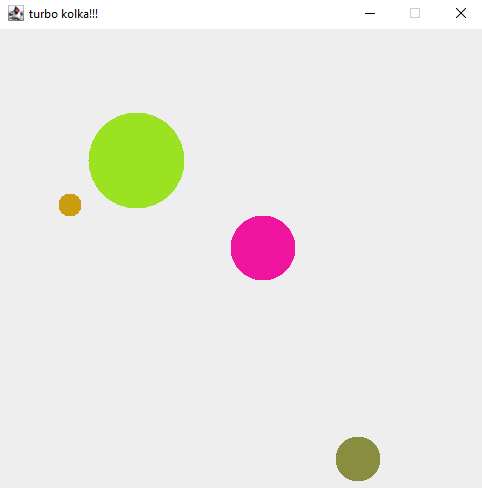

Used:
- JFrame class
- JPanel class

The application is implemented for 2 cases: single-thread and multi-thread. Below it's presented comparison from JProfiler for both versions. 

##### Overview usage:  
Single mode:  

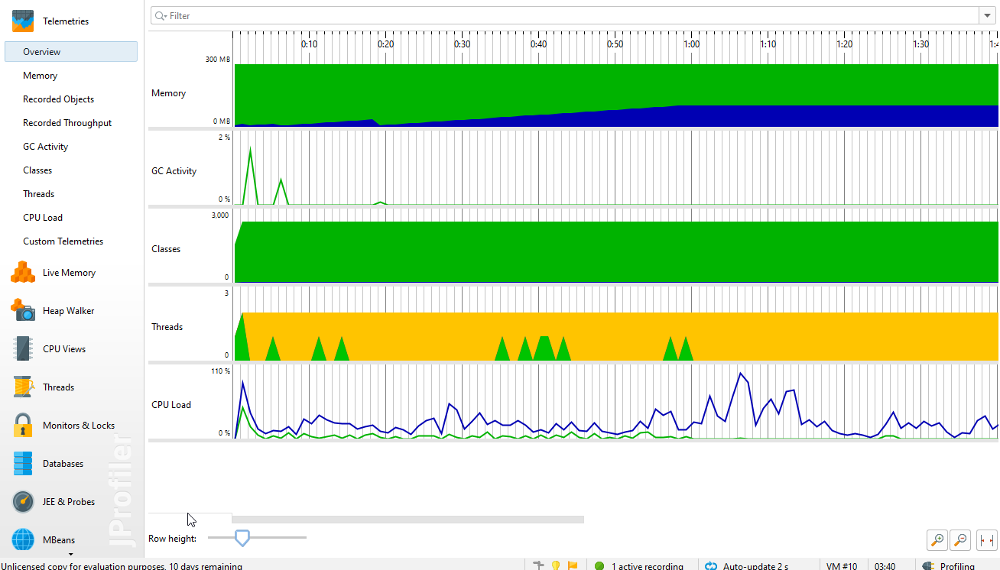

Multi mode:

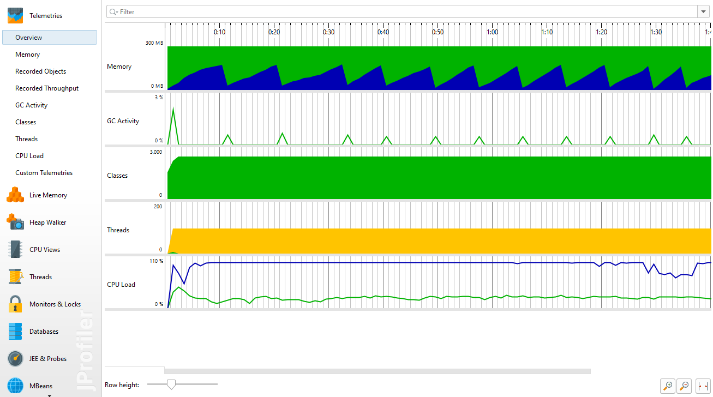

##### Memory usage:  
Single mode:  

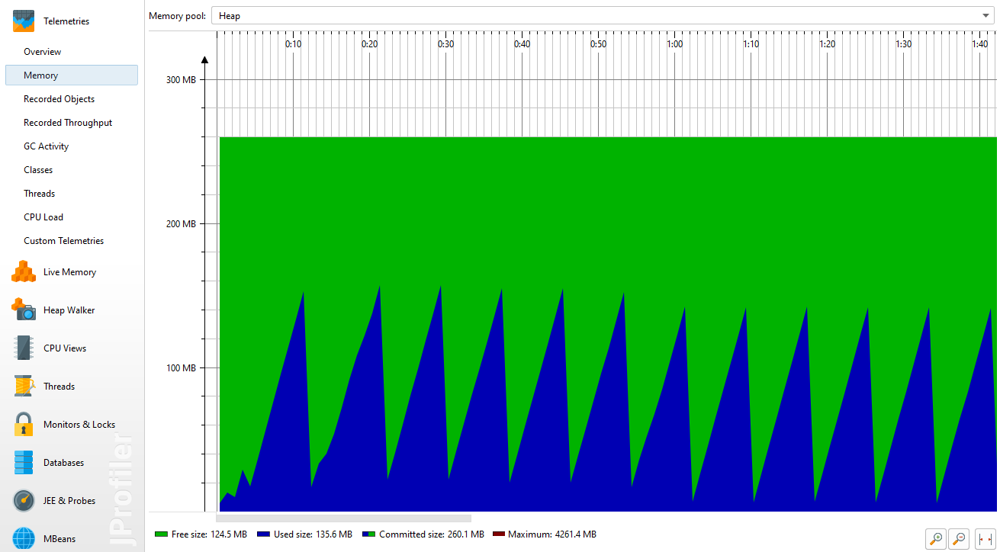

Multi mode:

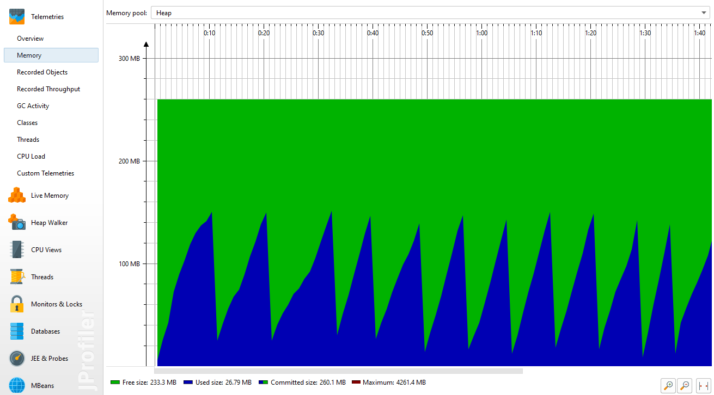

##### Live memory usage:  
Single mode:  

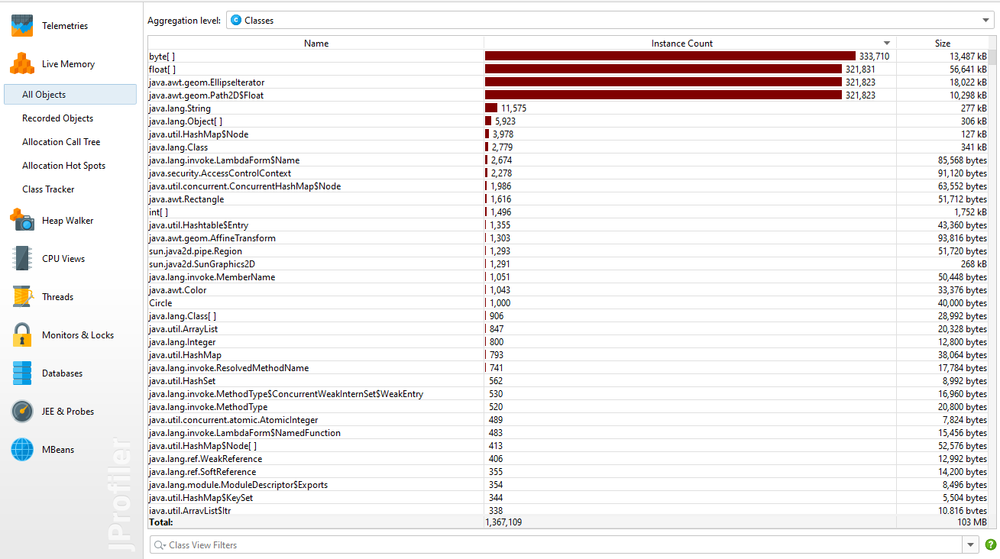

Multi mode:

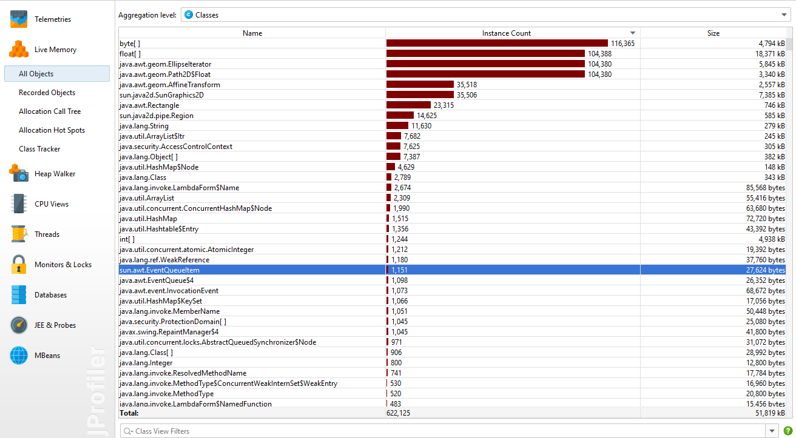

##### Thread history:  
Single mode:  

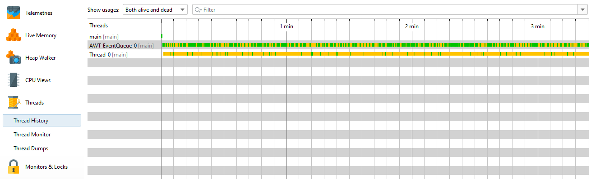

Multi mode:

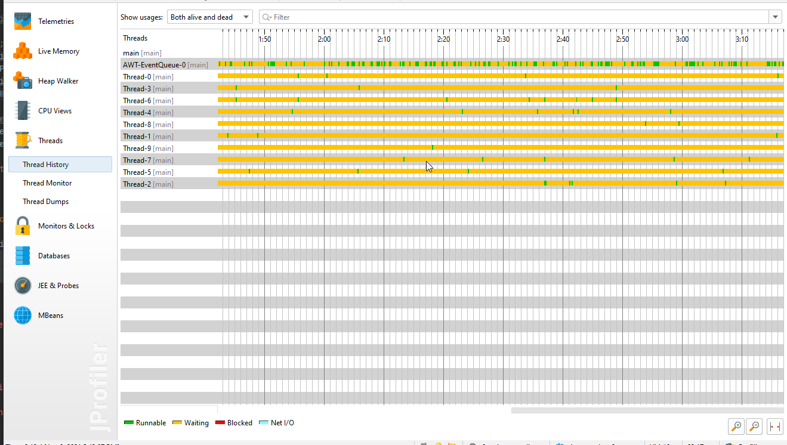

##### Call Tree:  
Single mode:  

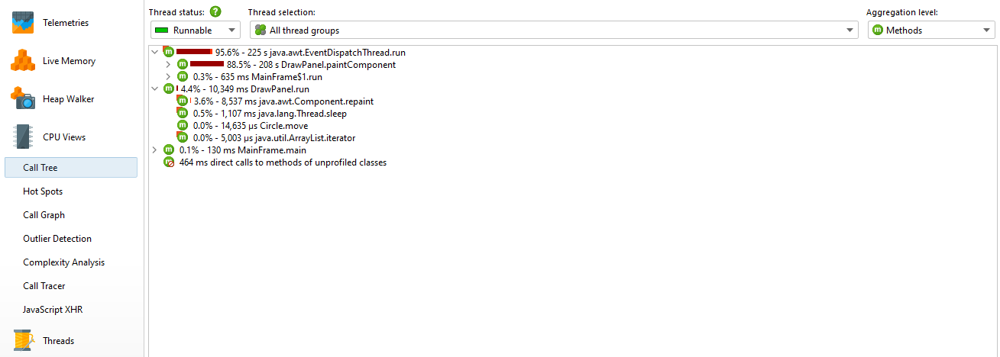

Multi mode:

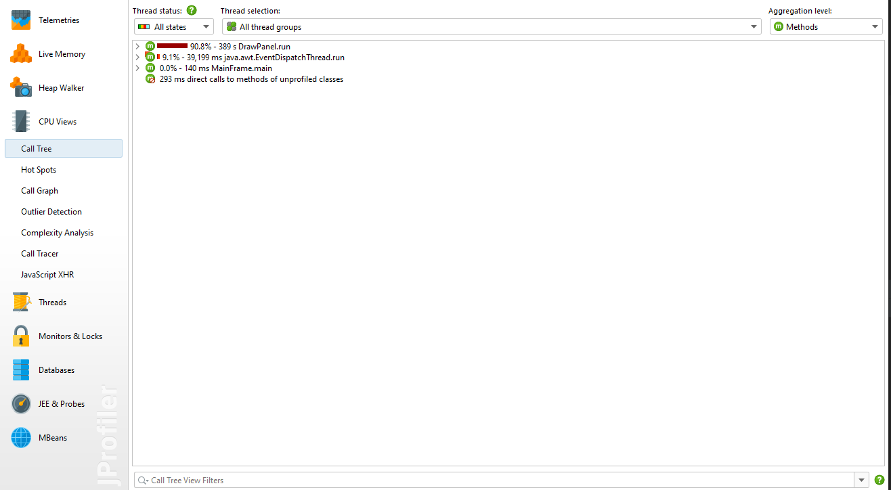

