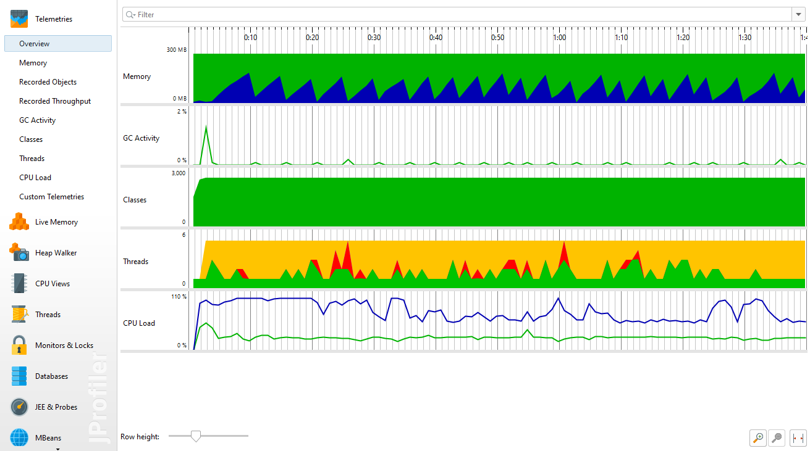
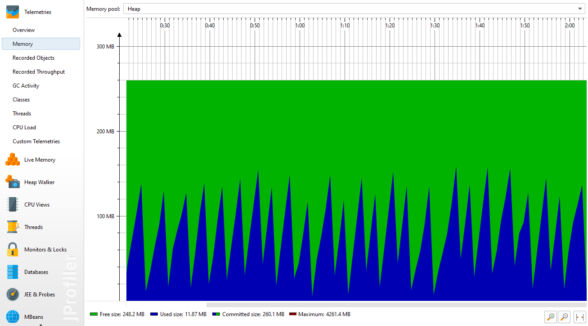
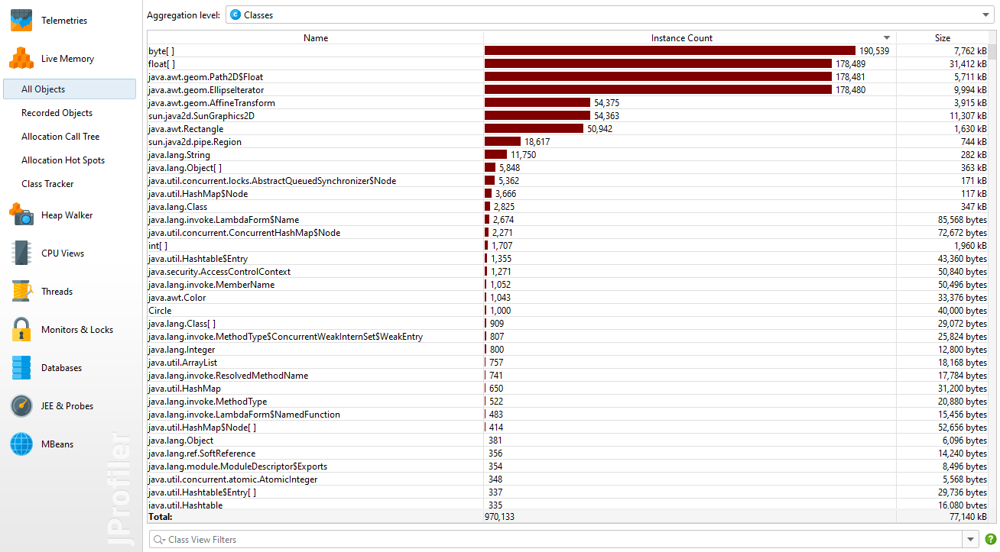
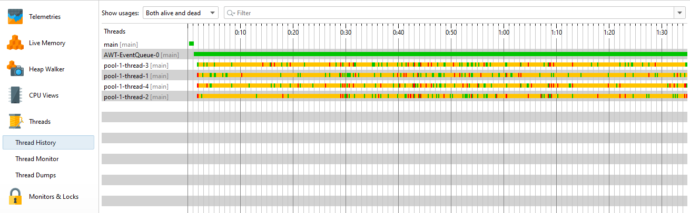
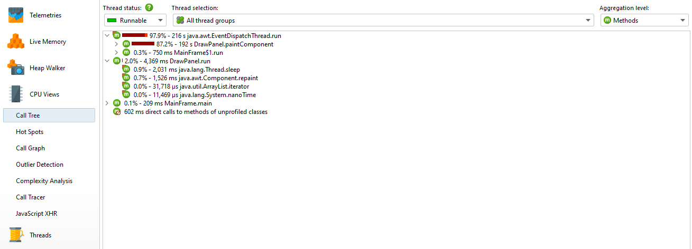
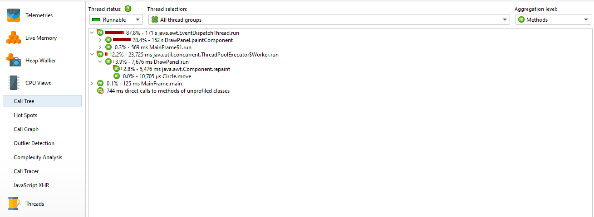

# Concurrency App

The application uses concurrency in Java language. The app simulate circles movement and display it on a window.  

Used:
- JFrame class
- JPanel class

The application is implemented for 3 cases: single-thread, multi-thread and multi-thread using Executor Service.  
Below it's presented comparison for 1000 circles, from JProfiler plugin, for those versions. 

### Overview usage:  
Single mode:  

Multi mode:

Executor Service mode:

### Memory usage:  
Single mode:  

Multi mode:

Executor Service mode:

### Live memory usage:  
Single mode:  

Multi mode:

Executor Service mode:

### Thread history:  
Single mode:  

Multi mode:

Executor Service mode:

### Call Tree:  
Single mode:  

Multi mode:

Executor Service mode:

